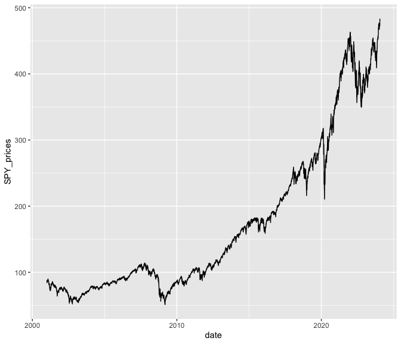
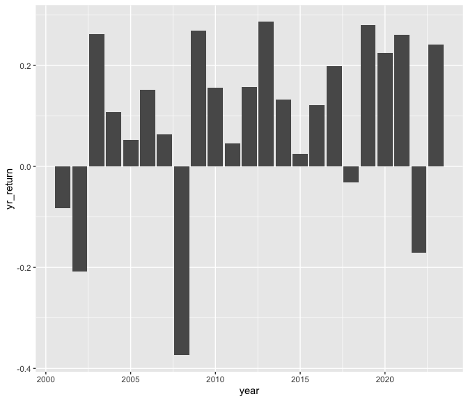

week2lecture
================
2024-01-24

- [read in data](#read-in-data)
- [statistics](#statistics)
- [plot of s&p prices](#plot-of-sp-prices)
- [plot of s&p yearly returns](#plot-of-sp-yearly-returns)

## read in data

``` r
df <- readRDS("data/wk2_stocks.rds")
str(df)
```

    ## 'data.frame':    5798 obs. of  4 variables:
    ##  $ SPY_prices : num  88.1 87.1 84.3 84.9 84.7 ...
    ##  $ SPY_returns: num  0.04804 -0.01076 -0.03264 0.00774 -0.00264 ...
    ##  $ SPY_vol    : num  88.1 87.1 84.3 84.9 84.7 ...
    ##  $ date       : Date, format: "2001-01-03" "2001-01-04" ...

## statistics

- the cumulative returns of the S&P index during this period is 218.33%
- the average daily returns of the S&P index during this period is 0.04%
- the standard deviation of the daily returns of the S&P index during
  this period is 1.22%

## plot of s&p prices

``` r
library(tidyverse)
ggplot(data = df, aes(x = date, y = SPY_prices)) +
  geom_line()
```

<!-- -->

## plot of s&p yearly returns

``` r
df %>%
  mutate(year = year(date)) %>%
  filter(year <= 2023) %>%
  group_by(year) %>%
  summarise(yr_return = sum(SPY_returns)) %>%
  
  ggplot(aes(x = year, y = yr_return)) +
  geom_col()
```

<!-- -->
